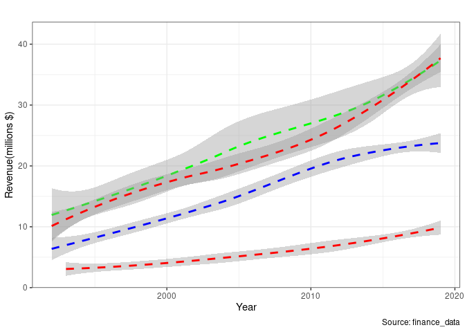

Summative Assessment EMATM0061 - Part A
================
Akshat Pande - tx21857 - 2153363
08/01/2022

# Section A

Data Wrangling tasks on provided finance data

## Code

Loading Libraries

``` r
library('readr')
library('utils')
library('psych')
library('plyr')
library('dplyr')
library('gmodels')
library('ggplot2')
library('doBy')
library('useful')
library('tidyr')
library('tools')
library('stringr')
```

## A.1 Reading into Dataframe

``` r
finance_data_original<-read_csv("finance_data_EMATM0061.csv", show_col_types = FALSE)
#Number of rows and column
dim(finance_data_original)
```

    ## [1] 1051   30

## A.2 Dataframe Column Manipulation

``` r
finance_data <- finance_data_original[c("state_year_code", "Details.Education.Education.Total","Details.Health.Health.Total.Expenditure","Details.Transportation.Highways.Highways.Total.Expenditure", "Totals.Revenue", "Totals.Expenditure")]
finance_data <- setNames(finance_data, c("state_year_code","education_expenditure","health_expenditure", "transport_expenditure", "totals_revenue", "totals_expenditure"))


head(finance_data[c(1,2,3)], n=5)
```

    ## # A tibble: 5 × 3
    ##   state_year_code education_expenditure health_expenditure
    ##   <chr>                           <dbl>              <dbl>
    ## 1 ALABAMA__1992                 3570524                 NA
    ## 2 ALABAMA__1993                 3663465                 NA
    ## 3 ALABAMA__1994                 3969277             487044
    ## 4 ALABAMA__1995                 4400912             491648
    ## 5 ALABAMA__1996                 4872259             514380

## A.3 Dataframe Column Analytical Addition

``` r
finance_data$totals_savings<-finance_data$totals_revenue - finance_data$totals_expenditure
dim(finance_data)
```

    ## [1] 1051    7

``` r
head(finance_data[c(1,5,6,7)], n=3)
```

    ## # A tibble: 3 × 4
    ##   state_year_code totals_revenue totals_expenditure totals_savings
    ##   <chr>                    <dbl>              <dbl>          <dbl>
    ## 1 ALABAMA__1992         10536166            9650515         885651
    ## 2 ALABAMA__1993         11389335           10242374        1146961
    ## 3 ALABAMA__1994         11599362           10815221         784141

## A.4 Column Modification

``` r
finance_data<-finance_data %>% separate(state_year_code,
                c("state","year"), extra='drop')

finance_data$state<-str_to_title(finance_data$state)

head(finance_data[c(1,2)], n=3)
```

    ## # A tibble: 3 × 2
    ##   state   year 
    ##   <chr>   <chr>
    ## 1 Alabama 1992 
    ## 2 Alabama 1993 
    ## 3 Alabama 1994

``` r
finance_data$year <- as.integer(finance_data$year)
head(finance_data[c(1,2)], n=3)
```

    ## # A tibble: 3 × 2
    ##   state    year
    ##   <chr>   <int>
    ## 1 Alabama  1992
    ## 2 Alabama  1993
    ## 3 Alabama  1994

## A.5 Plots

``` r
finance_data_plotL <- subset(finance_data, state == "Louisiana")
finance_data_plotM1 <- subset(finance_data, state == "Montana")
finance_data_plotM2 <- subset(finance_data, state == "Mississippi")
finance_data_plotK <- subset(finance_data, state == "Kentucky")
finance_data_plotL<-finance_data_plotL[c(1,2,6)]
finance_data_plotM1<-finance_data_plotM1[c(1,2,6)]
finance_data_plotM2<-finance_data_plotM2[c(1,2,6)]
finance_data_plotK<-finance_data_plotK[c(1,2,6)]

theme_set(theme_bw())

g<- ggplot(NULL, aes(x=year,y , colour=state) ) +
geom_smooth(data=finance_data_plotL, mapping=aes(x=year,y=totals_revenue/1000000 , colour=state), col="green", method="loess", linetype="dashed",) +
geom_smooth(data=finance_data_plotM1, mapping=aes(x=year,y=totals_revenue/1000000, colour=state), col="red", method="loess", linetype="dashed") +
geom_smooth(data=finance_data_plotM2, mapping=aes(x=year,y=totals_revenue/1000000, colour=state), col="blue", method="loess", linetype="dashed") +
geom_smooth(data=finance_data_plotK, mapping=aes(x=year,y=totals_revenue/1000000, colour=state), col="red", method="loess", linetype="dashed") +
  scale_x_continuous(breaks = seq(0, 2020, 10)) +
  labs(title=" ", y="Revenue(millions $)", x="Year", caption="Source: finance_data")

 
 
g + scale_color_manual(name="State", 
                        labels = c("Lousiana", 
                                   "Montana", 
                                   "Mississippi", 
                                   "Kentucky"), 
                        values = c("LO"="green", 
                                   "MO"="red", 
                                   "MI"="blue", 
                                   "K"="purple" 
                                   ))
```

    ## `geom_smooth()` using formula 'y ~ x'

    ## Warning: Removed 4 rows containing non-finite values (stat_smooth).

    ## `geom_smooth()` using formula 'y ~ x'

    ## Warning: Removed 3 rows containing non-finite values (stat_smooth).

    ## `geom_smooth()` using formula 'y ~ x'

    ## Warning: Removed 2 rows containing non-finite values (stat_smooth).

    ## `geom_smooth()` using formula 'y ~ x'

    ## Warning: Removed 2 rows containing non-finite values (stat_smooth).

<!-- -->

``` r
plot(g)
```

    ## `geom_smooth()` using formula 'y ~ x'

    ## Warning: Removed 4 rows containing non-finite values (stat_smooth).

    ## `geom_smooth()` using formula 'y ~ x'

    ## Warning: Removed 3 rows containing non-finite values (stat_smooth).

    ## `geom_smooth()` using formula 'y ~ x'

    ## Warning: Removed 2 rows containing non-finite values (stat_smooth).

    ## `geom_smooth()` using formula 'y ~ x'

    ## Warning: Removed 2 rows containing non-finite values (stat_smooth).

<!-- -->

## A.6 Get Decade Function

``` r
retDecade = function(value){ return(value - (value%%10)) }
finance_data$decade<-retDecade(finance_data$year)

descstats<-function(x) {descStat(x, na.rm=TRUE)}
result<-summaryBy(totals_savings~decade, data=finance_data, FUN=mean, na.rm=TRUE)

head(result)
```

    ## # A tibble: 4 × 2
    ##   decade totals_savings.mean
    ##    <dbl>               <dbl>
    ## 1   1990            1916854.
    ## 2   2000             348721.
    ## 3   2010            2610936.
    ## 4     NA            2257927.

# 

## Including Plots
