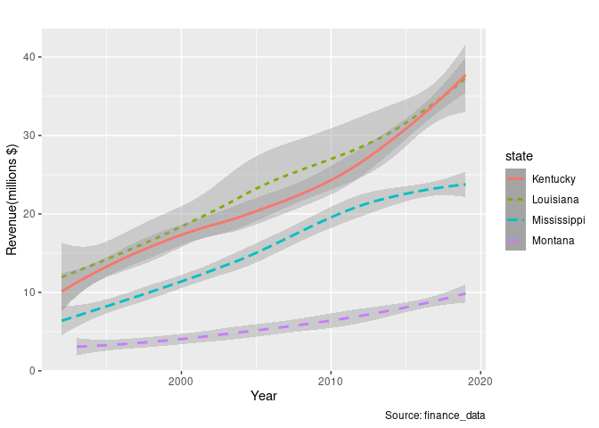

Summative Assessment EMATM0061 - Part A
================
Akshat Pande \| TX21857 \| 2153363
<br> Date : 12/01/2022

# Section A

Data Wrangling tasks on financial data

## Code

Loading Libraries

``` r
library('readr') #tidyverse
library('utils')
library('psych')
library('plyr')
library('dplyr') #tidyverse
library('gmodels')
library('ggplot2') #tidyverse
library('doBy')
library('useful')
library('tidyr')
library('tools')
library('stringr')
```

## A.1 Reading CSV into Dataframe

### Tasks

-   Downloading csv file
-   Load csv file into R data frame
-   Output the number of rows and column of the data frame

``` r
finance_data_original<-read_csv("finance_data_EMATM0061.csv", show_col_types = FALSE)
#Number of rows and column
dim(finance_data_original)
```

    ## [1] 1051   30

## A.2 Dataframe Column Manipulation

### Tasks

-   New data frame (subset of original data frame)
-   Corresponding columns for new data frame
-   Display the first five rows and first three columns of the subset
    data frame

``` r
finance_data <- finance_data_original[c("state_year_code", "Details.Education.Education.Total","Details.Health.Health.Total.Expenditure","Details.Transportation.Highways.Highways.Total.Expenditure", "Totals.Revenue", "Totals.Expenditure")]
finance_data <- setNames(finance_data, c("state_year_code","education_expenditure","health_expenditure", "transport_expenditure", "totals_revenue", "totals_expenditure"))


head(finance_data[c(1:3)], n=5)
```

    ## # A tibble: 5 × 3
    ##   state_year_code education_expenditure health_expenditure
    ##   <chr>                           <dbl>              <dbl>
    ## 1 ALABAMA__1992                 3570524                 NA
    ## 2 ALABAMA__1993                 3663465                 NA
    ## 3 ALABAMA__1994                 3969277             487044
    ## 4 ALABAMA__1995                 4400912             491648
    ## 5 ALABAMA__1996                 4872259             514380

## A.3 Dataframe Column Analytical Addition

### Tasks

-   Adding column to data frame
-   Setting values to new column by using existing values of columns and
    applying calculations.
-   Display the first three rows and four columns(as mentioned) of the
    new data frame

``` r
finance_data$totals_savings<-finance_data$totals_revenue - finance_data$totals_expenditure
dim(finance_data)
```

    ## [1] 1051    7

``` r
head(finance_data[c("state_year_code","totals_revenue","totals_expenditure","totals_savings")], n=3)
```

    ## # A tibble: 3 × 4
    ##   state_year_code totals_revenue totals_expenditure totals_savings
    ##   <chr>                    <dbl>              <dbl>          <dbl>
    ## 1 ALABAMA__1992         10536166            9650515         885651
    ## 2 ALABAMA__1993         11389335           10242374        1146961
    ## 3 ALABAMA__1994         11599362           10815221         784141

## A.4 Column Modification

### Tasks

-   Separate column into multiple columns using given conditions
-   Convert the column into specified formats and data types
-   Display the first three rows and five columns(as mentioned) of the
    modified data frame

``` r
finance_data<-finance_data %>% separate(state_year_code,
                c("state","year"), extra='drop')

finance_data$state<-str_to_title(finance_data$state)

head(finance_data[c(1,2)], n=3)
```

    ## # A tibble: 3 × 2
    ##   state   year 
    ##   <chr>   <chr>
    ## 1 Alabama 1992 
    ## 2 Alabama 1993 
    ## 3 Alabama 1994

``` r
finance_data$year <- as.integer(finance_data$year)
head(finance_data[c("state","year","totals_revenue","totals_expenditure","totals_savings")], n=3)
```

    ## # A tibble: 3 × 5
    ##   state    year totals_revenue totals_expenditure totals_savings
    ##   <chr>   <int>          <dbl>              <dbl>          <dbl>
    ## 1 Alabama  1992       10536166            9650515         885651
    ## 2 Alabama  1993       11389335           10242374        1146961
    ## 3 Alabama  1994       11599362           10815221         784141

## A.5 Plots

### Tasks

-   Generate plot using given conditions
-   Change attributes of the plot using given conditions
-   Plot

``` r
finance_data_plotL <- subset(finance_data, state == "Louisiana")
finance_data_plotM1 <- subset(finance_data, state == "Montana")
finance_data_plotM2 <- subset(finance_data, state == "Mississippi")
finance_data_plotK <- subset(finance_data, state == "Kentucky")
finance_data_plotL<-finance_data_plotL[c(1,2,6)]
finance_data_plotM1<-finance_data_plotM1[c(1,2,6)]
finance_data_plotM2<-finance_data_plotM2[c(1,2,6)]
finance_data_plotK<-finance_data_plotK[c(1,2,6)]


g<- ggplot(NULL, aes(x=year,y, lty=state, col=state, method="loess") ) +
geom_smooth(data=finance_data_plotL, mapping=aes(x=year,y=totals_revenue/1000000,)) +
geom_smooth(data=finance_data_plotM1, mapping=aes(x=year,y=totals_revenue/1000000)) +
geom_smooth(data=finance_data_plotM2, mapping=aes(x=year,y=totals_revenue/1000000)) +
geom_smooth(data=finance_data_plotK, mapping=aes(x=year,y=totals_revenue/1000000)) +
  scale_x_continuous(breaks = seq(0, 2020, 10)) +
  labs(title=" ", y="Revenue(millions $)", x="Year", caption="Source: finance_data")

g
```

<!-- -->

## A.6 Get Decade Function

### Tasks

-   Create function as specified
-   Add column using the created function
-   Show the three states with highest mean-average savings in decade
    2000

``` r
retDecade = function(value){ return(value - (value%%10)) }
finance_data$decade<-retDecade(finance_data$year)

descstats<-function(x) {descStat(x, na.rm=TRUE)}

finance_data2000<-subset(finance_data, decade == 2000)

result<-summaryBy(totals_savings~state, data=finance_data2000, FUN=mean, na.rm=TRUE)
result$totals_savings.mean<-as.integer(result$totals_savings.mean)
result$decade<-2000
result<-result[order(-result$totals_savings.mean), ]  
head(result, n=3)
```

    ## # A tibble: 3 × 3
    ##   state      totals_savings.mean decade
    ##   <chr>                    <int>  <dbl>
    ## 1 Texas                  4103351   2000
    ## 2 Ohio                   3025980   2000
    ## 3 California             2510483   2000

## A.7 State Summary

### Tasks

-   Create Data frame for Alaska with decades
-   Calculate mean and median for corresponding columns
-   Display Alaska data frame

``` r
alaska_sum<-subset(finance_data, state=="Alaska")

alaska_summary<-summaryBy(education_expenditure~decade, data=alaska_sum, FUN=mean, na.rm=TRUE)
alaska_summary$ed_md<-summaryBy(education_expenditure~decade, data=alaska_sum, FUN=median, na.rm=TRUE)$education_expenditure.median
alaska_summary$he_mn<-summaryBy(health_expenditure~decade, data=alaska_sum, FUN=mean, na.rm=TRUE)$health_expenditure.mean
alaska_summary$he_md<-summaryBy(health_expenditure~decade, data=alaska_sum, FUN=median, na.rm=TRUE)$health_expenditure.median
alaska_summary$tr_mn<-summaryBy(transport_expenditure~decade, data=alaska_sum, FUN=mean, na.rm=TRUE)$transport_expenditure.mean
alaska_summary$tr_md<-summaryBy(transport_expenditure~decade, data=alaska_sum, FUN=median, na.rm=TRUE)$transport_expenditure.median
alaska_summary <- setNames(alaska_summary, c("decade","ed_mn","ed_md", "he_mn", "he_md", "tr_mn","tr_md"))
print(alaska_summary)
```

    ## # A tibble: 3 × 7
    ##   decade    ed_mn    ed_md   he_mn   he_md    tr_mn    tr_md
    ##    <dbl>    <dbl>    <dbl>   <dbl>   <dbl>    <dbl>    <dbl>
    ## 1   1990 1246426. 1246864. 162785. 164546.  582137.  582710.
    ## 2   2000 1546233. 1566815  152003. 160168   723347.  687407 
    ## 3   2010 2642603. 2595207  274688  278394  1210822. 1271514

## A.8 Impute by median

### Tasks

-   create impute_by_median function which takes vector numerical
-   replace na values in the vector to median of the columns
-   Create a data frame idaho_2000 for Idaho state in the decade 2000
-   Apply impute_by_median function to idaho_2000
-   Display a subset of idaho_2000_imputed

``` r
impute_by_median <- function(input_vector) {
  
   ifelse(is.na(input_vector),median(input_vector, na.rm=TRUE), input_vector)
  
}

idaho_2000<-subset(finance_data, state=="Idaho" & decade == "2000")
idaho_2000<-select(idaho_2000,-c(state,decade))

idaho_2000_imputed<-sapply(idaho_2000, impute_by_median)

idaho_2000_imputed<-as.data.frame(idaho_2000_imputed)

head(idaho_2000_imputed[c("year","health_expenditure","education_expenditure","totals_savings")], n=5)
```

    ##   year health_expenditure education_expenditure totals_savings
    ## 1 2000            98510.0               1663980        1083732
    ## 2 2001           103705.0               1768837         334438
    ## 3 2002           109896.5               1768837        -746375
    ## 4 2003           116088.0               1886421         709085
    ## 5 2004           131165.0               1768837        1349740

## Including Plots
