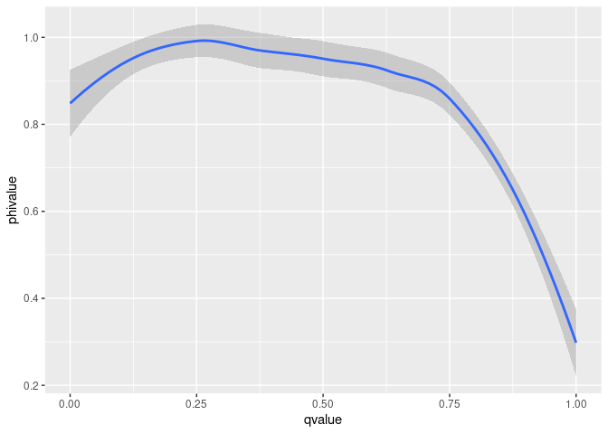
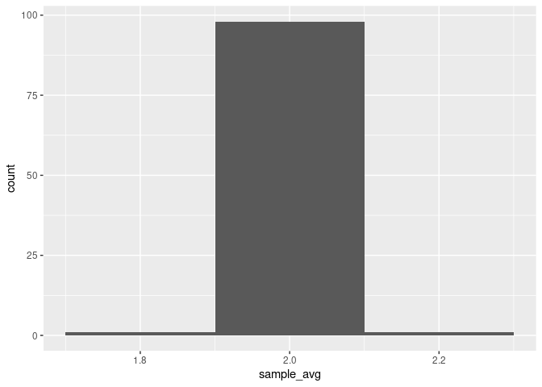
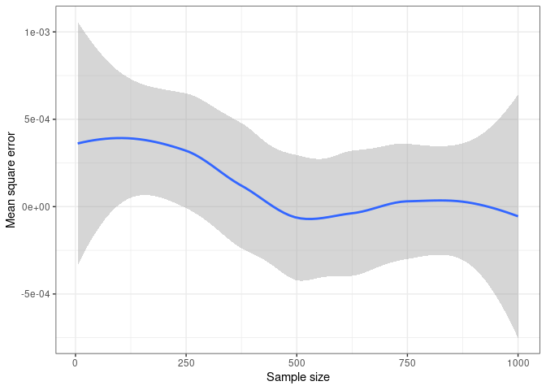

Summative Assessment EMATM0061 - Part B
================
Akshat Pande \| TX21857 \| 2153363
<br> 12/01/2022

# Section B

## B.1 Faulty Security System Probability

### Given

####Assumption - passage of time is per minute *p*<sup>*o*</sup> -
conditional probability that the sensor makes a sound if there is no
person within one meter of the gate <br>*p*<sup>1</sup> - conditional
probability that the sensor makes at least once, if there is at least
one person present <br>*q* - probability that at least one person walks
within one meter of the gate <br>*ϕ* - conditional probability that at
one person has passed during the minute, and the alarm made the sound.

therefore, *q*<sup>*o*</sup> - probability that nobody walks within one
meter of the gate

Part (a):

Function used ->

*ϕ* =
(*p*<sup>1</sup>/*q*)/(*p*<sup>*o*</sup>/*q*<sup>*o*</sup>+*p*<sup>1</sup>/*q*)

``` r
c_prob_person_given_alarm = function(p0,p1,q){
   
  (p1/q) / ((p0/(1-q)) + (p1/q))

}
```

Part (b):

Value of *ϕ* <br> Given: *p*<sup>*o*</sup> = 0.05, <br>
*p*<sup>1</sup> = 0.95, <br> *q* = 0.1

``` r
phi <- c_prob_person_given_alarm(0.05,0.95,0.1)

print(phi)
```

    ## [1] 0.994186

Part (c):

Graph between *ϕ* and *q* for varying value of *q* <br> Given :
*p*<sup>*o*</sup> = 0.05 , <br> *p*<sup>1</sup> = 0.95

``` r
library(ggplot2)

x1<-seq(from=0, to=1, by=.01)

print(x1)
```

    ##   [1] 0.00 0.01 0.02 0.03 0.04 0.05 0.06 0.07 0.08 0.09 0.10 0.11 0.12 0.13 0.14
    ##  [16] 0.15 0.16 0.17 0.18 0.19 0.20 0.21 0.22 0.23 0.24 0.25 0.26 0.27 0.28 0.29
    ##  [31] 0.30 0.31 0.32 0.33 0.34 0.35 0.36 0.37 0.38 0.39 0.40 0.41 0.42 0.43 0.44
    ##  [46] 0.45 0.46 0.47 0.48 0.49 0.50 0.51 0.52 0.53 0.54 0.55 0.56 0.57 0.58 0.59
    ##  [61] 0.60 0.61 0.62 0.63 0.64 0.65 0.66 0.67 0.68 0.69 0.70 0.71 0.72 0.73 0.74
    ##  [76] 0.75 0.76 0.77 0.78 0.79 0.80 0.81 0.82 0.83 0.84 0.85 0.86 0.87 0.88 0.89
    ##  [91] 0.90 0.91 0.92 0.93 0.94 0.95 0.96 0.97 0.98 0.99 1.00

``` r
plotphi<- as.data.frame(x1)
dim(plotphi)
```

    ## [1] 101   1

``` r
x2<-seq(from=0, to=0.1, by=.01)
c_prob = function(p0,p1,input_vector){
   (p1/input_vector) / ((p0/(1-input_vector)) + (p1/input_vector))
}

x2 <-c_prob(0.05,0.95,x1)
x2[is.na(x2)]<-0
phivalue<-as.data.frame(x2)
plotphi$phivalue<-x2
plotphi <-setNames(plotphi,c("qvalue", "phivalue"))
head(plotphi)
```

    ##   qvalue  phivalue
    ## 1   0.00 0.0000000
    ## 2   0.01 0.9994687
    ## 3   0.02 0.9989270
    ## 4   0.03 0.9983749
    ## 5   0.04 0.9978118
    ## 6   0.05 0.9972376

``` r
flow<- ggplot(plotphi, aes(x=qvalue,y=phivalue) ) +geom_smooth()
flow
```

    ## `geom_smooth()` using method = 'loess' and formula 'y ~ x'

<!-- -->

## B.2 Discrete function

### Given -

<br> *α*, *β*, *γ* ∈ \[0,1\] <br> X(DNV)- {0,1,2,5} <br> P(X=1)= *α*
<br> P(X=2)= *β* <br> P(X=5)= *γ* <br> P(X ∉ {0,1,2,5}) = 0

1.  Probability mass function =

P(x)= {1 -*α* − *β* − *γ* , if x=0}<br> {*α*, if x=1 }<br> {*β*, if
x=2}<br> {*γ*, if x=5}<br> {0, otherwise}<br>

2.  E(X) = *α* + 2*β* + 5*γ*

3.  E(*X*<sup>2</sup>) - *E*(*X*)<sup>2</sup> =
    (*α*+4*β*+25*γ*) − (*α*+2*β*+5*γ*)<sup>2</sup>

<br>*X*1, *X*2...., *X**n* <br>P(Xi=1)= *α*, <br>P(Xi=2)= *β*,
<br>P(Xi=5)= *γ* and <br>P(X ∉ {0,1,2,5}) = 0

let *X̃* = <br>$\\frac{1}{n}$ $\\sum\_{i = 1}^{n}Xi$ be the sample mean

4.  E(X) = $\\frac{1}{n}$ $\\sum\_{i = 1}^{n}Xi$ \* (*α*+2*β*+5*γ*)

5.  E(*X*<sup>2</sup>) - *E*(*X*)<sup>2</sup> = $\\frac{1}{n}$
    $\\sum\_{i = 1}^{n}Xi$ \*
    ((*α*+4*β*+25*γ*) − (*α*+2*β*+5*γ*)<sup>2</sup>)

6.  

``` r
library('dplyr')
```

    ## 
    ## Attaching package: 'dplyr'

    ## The following objects are masked from 'package:stats':
    ## 
    ##     filter, lag

    ## The following objects are masked from 'package:base':
    ## 
    ##     intersect, setdiff, setequal, union

``` r
library('purrr')
sample_X_0125<-function(n,alpha,beta,gamma){
  sample_X<-data.frame(U=runif(n))%>%
  mutate(X=case_when(
  (0<=U)&(U<alpha)~1,
  (alpha<=U)&(U<alpha+beta)~2,
  (alpha+beta<=U)&(U<alpha+beta+gamma)~5,
  (alpha+beta+gamma<=U)&(U<=1)~0))%>%pull(X)
  return(sample_X)
}
```

7.  

``` r
n<-100000
alpha<-1/10
beta<-2/10
gamma<-3/10

sample_X<-sample_X_0125(n,alpha,beta,gamma)
mean(sample_X)
```

    ## [1] 1.99806

8.  

``` r
alpha<-1/10
beta<-2/10
gamma<-3/10
simulation_by_n<-data.frame(n=seq(0,10000,100))%>%
  mutate(sample_X=map(.x=n,~sample_X_0125(.x,alpha,beta,gamma)))%>%
  mutate(sample_avg=map_dbl(.x=sample_X,~mean(.x)))%>%
  select(-sample_X)%>%
  mutate(expectation=alpha+2*beta+5*gamma)
  simulation_by_n%>%head(5)
```

    ##     n sample_avg expectation
    ## 1   0        NaN           2
    ## 2 100   2.140000           2
    ## 3 200   1.885000           2
    ## 4 300   1.943333           2
    ## 5 400   2.007500           2

1.  

``` r
plotit<- ggplot(simulation_by_n, aes(x=sample_avg)) + geom_histogram(binwidth=0.2)

plotit
```

    ## Warning: Removed 1 rows containing non-finite values (stat_bin).

<!-- -->

8.  

``` r
expectation<- alpha + 2*beta + 5*gamma
print(expectation)
```

    ## [1] 2

``` r
var(sample_X)
```

    ## [1] 4.40424

## B.3 Exponential Distribution.

1.  Formula for population mean and variance

Population mean for exponential random variable X with paramater *λ* =
$\\frac{1}{\\lambda}$

Variance for exponential variable random variable X with parameter *λ* =
$\\frac{2}{\\lambda^2}$

2.  Formula for cumulative distribution function and quantile function
    for exponential random variables with paramter *λ*

Cummulative function is given by = <br> *F**λ*(*x*) = {0, if x\<=0} {1 -
*e*<sup>−*λ**x*</sup>
, if x>0}

Quantile function is given by = <br>
*F*<sup>−1</sup>*λ*(*x*)
= inf{ x ∈ R : F *λ* x \<=p} {-∞, if p=0} { $\\frac{1}{\\lambda}$
ln(1-p), if p ∈ (0,1\]}

3.  

Maximum Likelihood Estimation = *X̄*

4.  

``` r
library(dplyr)
set.seed(0)
num_trials_per_sample_size<-100
min_sample_size<-5
max_sample_size<-1000
sample_size_inc<-5
lambda_0<-0.01
poisson_simulation_df<-expand.grid(trial=seq(num_trials_per_sample_size),
sample_size=seq(min_sample_size,max_sample_size,
sample_size_inc))%>%
# create data frame of all pairs of sample_size and trial
mutate(simulation=pmap(.l=list(trial,sample_size),
.f=~rpois(.y,lambda=lambda_0)))%>%
# simulate sequences of Gaussian random variables
mutate(lambda_mle=map_dbl(.x=simulation,.f=mean))%>%
# compute the sample sd
group_by(sample_size)%>%
summarise(msq_error=mean((lambda_mle-lambda_0)*2))
poisson_simulation_df%>%
ggplot(aes(x=sample_size,y=msq_error))+
geom_smooth()+
theme_bw()+
xlab("Sample size")+ylab("Mean square error")
```

    ## `geom_smooth()` using method = 'loess' and formula 'y ~ x'

<!-- -->

5.  

``` r
library(readr)
bird_data<-read.csv("bird_data_EMATM0061.csv")

alpha<-0.00000004192201
sample_size<-length(bird_data$Time)
sample_mean<-mean(bird_data$Time)
sample_sd<-sd(bird_data$Time)
t<-qt(1-alpha/2,df=sample_size-1)
confidence_interval_l<-sample_mean-t*sample_sd/sqrt(sample_size)
confidence_interval_u<-sample_mean+t*sample_sd/sqrt(sample_size)
confidence_interval<-c(confidence_interval_l,confidence_interval_u)
print(confidence_interval)
```

    ## [1] 1476693 1554413

``` r
percentage<-(confidence_interval[1] / confidence_interval[2]) * 100
print(percentage)
```

    ## [1] 95

``` r
print("Confidence level of 95% achieved for alpha=0.00000004192201")
```

    ## [1] "Confidence level of 95% achieved for alpha=0.00000004192201"
